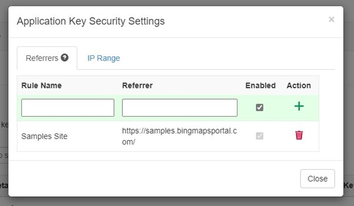
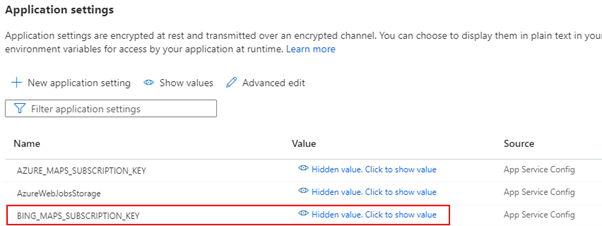

## Introduction

When using [Bing Maps for Enterprise](https://www.microsoft.com/maps) in your solution/application, you need a **Basic Key** (limited free trial) or an **Enterprise key** to use the services. For example, you would add a Bing Maps Key to the script URL loading the Bing Maps Web Control like this:

```html
<script src="https://www.bing.com/api/maps/mapcontrol?callback=GetMap&key={your bing maps key}"></script>
```

Now your key is open text on your site source code and people who look can find and use your key. Search engines will index your page and, as a result, will also store your key. Is this a problem? Not really.

## Protecting

The Bing Maps key is mainly used to determine the usage and allow access to Bing Maps features. To protect your Bing Maps key, so it can't be misused on other websites, there is an option in the [Bing Maps Dev Center](https://www.bingmapsportal.com/) to protect your key. This security option allows you to specify a list of referrers (website URLs) and IP numbers who can use your key. When at least one referrer rule is active, any requests that omit a referrer and any requests from non-approved referrers will be blocked, preventing others from using your key for requests. You can have up to 300 referrer and IP security rules per key.



Your key is now protected but is still visible in your website code. So how do I hide my Bing Maps key?

> A best practice is **never to store any keys or certificates in source code**. 

## Hiding

To hide the Bing Maps key, you create a simple API endpoint that will only return the Bing Maps key if the request comes from a trusted referral URL. The [Bing Maps Samples](https://samples.bingmapsportal.com/) site is a good example that uses this approach.

In this example we are using an Anonymous HttpTrigger [Azure Function](https://azure.microsoft.com/en-us/services/functions/) written in C# that returns the Bing Maps key: 

```csharp
public static class GetBingMapsKey
{
    private static readonly string[] allowd = { "https://samples.bingmapsportal.com/",
                                                "http://localhost"};

    [FunctionName("GetBingMapsKey")]
    public static IActionResult Run([HttpTrigger(AuthorizationLevel.Anonymous, "get", Route = null)] HttpRequest req)
    {
        string referer = req.Headers["Referer"];
        if (string.IsNullOrEmpty(referer))
            return new UnauthorizedResult();

        string result = Array.Find(allowd, site => referer.StartsWith(site, StringComparison.OrdinalIgnoreCase));
        if (string.IsNullOrEmpty(result))
            return new UnauthorizedResult();

        // Get your Bing Maps key from https://www.bingmapsportal.com/
        string key = Environment.GetEnvironmentVariable("BING_MAPS_SUBSCRIPTION_KEY");

        return new OkObjectResult(key);
    }
}
```

The Bing Maps key is stored server-side in this Azure Function Application settings field. We are using the `GetEnvironmentVariable()` to get the key.


 
Next, we need to load the Bing Maps script and get the key from the API client-side. Finally, we use the following code snippet to load Bing Maps dynamically:

```html
<script>
    // Dynamic load the Bing Maps Key and Script
    // Get your own Bing Maps key at https://www.microsoft.com/maps
    (async () => {
        let script = document.createElement("script");
        let bingKey = await fetch("https://samples.azuremaps.com/api/GetBingMapsKey").then(r => r.text()).then(key => { return key });
        script.setAttribute("src", `https://www.bing.com/api/maps/mapcontrol?callback=GetMap&key=${bingKey}`);
        document.body.appendChild(script);
    })();
</script>
```
  
The browser will run this code and create at runtime in the DOM the same line of `<script>` tag we have seen at the beginning of this blog post to load Bing Maps and the Key. An additional advantage is that the Bing Maps key is not stored in the source code anymore and that you can use [IaC](/infrastructure-as-code) and build pipelines to deploy the solution.

> **Note:** Only hiding the Bing Maps key alone is not enough as a security measure. We recommend you still enable the security option in the Bing Maps Dev Center!