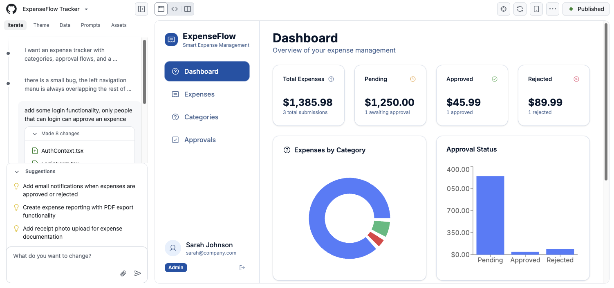
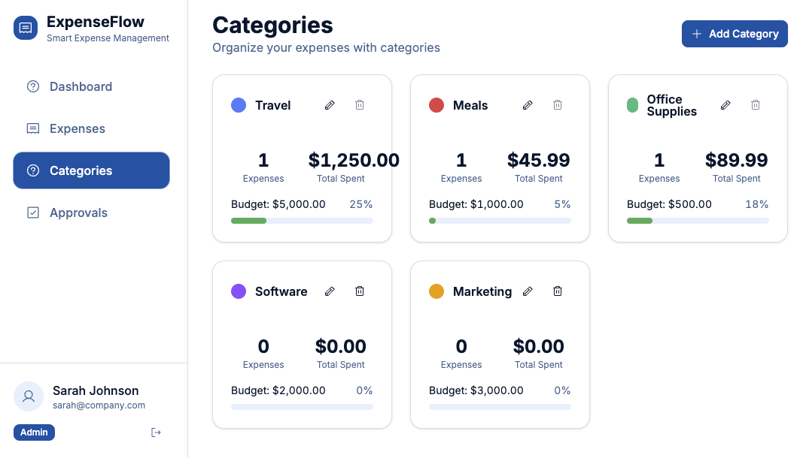

Imagine this: you work at a company, and you have a clear idea for a web app, something like a custom expense tracking tool that fits exactly the way your team works. You’ve tried off-the-shelf products, but they always miss the mark. The alternative, building your own application, is usually time-consuming, expensive, and requires getting developers involved early on. But what if you could prototype your idea, adjust the UI, change the data model, and publish it, all without writing a single line of code?

**That’s exactly what GitHub Spark makes possible**

## What is GitHub Spark

[GitHub Spark](https://github.com/spark) is a new tool in the GitHub Copilot ecosystem, designed for anyone who wants to bring software ideas to life without being a developer. It leverages AI to translate natural language descriptions, yes, just plain text, into a fully functional web application. You describe what you want, and Spark generates the user interface, the data layer, and even deployment instructions. It doesn’t just simulate an app, it builds it.

## Describe Your Idea in Plain Text

The process is surprisingly intuitive. You open GitHub Spark and simply write what you want the app to do: “I want an expense tracker with categories, approval flows, and a dashboard for summaries.” Within minutes, Spark will scaffold your application, including forms, tables, styling, and storage. You’ll see it running right away. This is not a fake mockup, this is a live prototype. And if something isn’t quite right? Just type what you want to change. “Make the buttons blue.” “Add a notes field to each expense.” “Group the expenses by project.” Spark listens, understands, and adapts in real time.

## Customize Everything Visually

It’s not only functional, it’s visual. You can fine-tune the app’s look and feel without design tools or CSS. Change the typography, update the color palette, adjust the border radius. Want to change how the app stores or displays data? That’s editable too. The whole experience feels like talking to a smart assistant who just happens to be a front-end dev, a back-end dev, and a designer rolled into one.

## Speed and Accessibility for All Creators

At its core, GitHub Spark is about speed and accessibility. For non-technical creators, this is an incredibly powerful way to test ideas, validate concepts, or even deploy simple tools that are good enough to use right away. And for technical teams, it’s a great way to get ahead, kickstarting the UI or getting a working data schema in place before engineering resources are allocated.

## Developers?

GitHub Spark isn’t going to replace skilled developers for complex enterprise-grade systems. It’s not meant to. But what *is* impressive is how quickly and accurately it lets you build a real, working prototype. You don’t just explain the idea, you see it, use it, and iterate on it. That alone makes it one of the most interesting AI-powered tools GitHub has launched since Copilot.

## Ready to Try Spark?

If you’re curious, Spark is now available in public preview, and you can read more about it on GitHub’s official documentation. But the best way to understand Spark is to try it. Think of an idea you’ve had for a while, open Spark, and just start describing it.

You’ll be surprised how fast you can go from “I wish I had an app for this…” to “Here’s the link to the [expense app](https://expenseflow-tracker--cschotte.github.app/), try it out.”.

